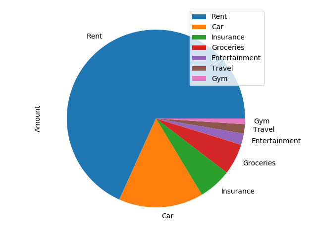
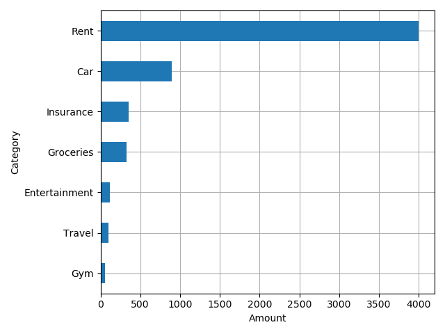
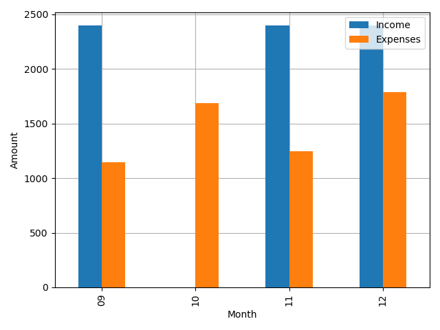
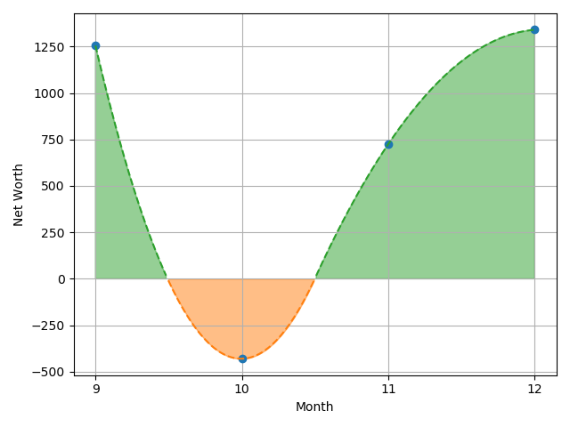

# Money Tracker
**WORK IN PROGRESS**

This is a simple Python API to read and modify a database, where the database contains simply one table, "transactions." The API is able to create, read, and modify a database that contains **transactions** given the date, amount, and category. The goal is simply to track income and outcome of the user's cashflow.

This repo is to practice `sqlite3`, `pandas`, and CI/CD.

TODO: Create a GUI to visualize the data.

## Requirements
- Python 3.6
- Python libs: `pandas`, `numpy`, `scipy`, `matplotlib`

---

## Visualization Example

An example with the following dataset,

|   rowid |   amount | date                | category      |
|--------:|---------:|:--------------------|:--------------|
|       1 |     2400 | 2021-09-01 00:00:00 | Salary        |
|       2 |    -1000 | 2021-09-05 00:00:00 | Rent          |
|       3 |      -50 | 2021-09-05 00:00:00 | Insurance     |
|       4 |      -15 | 2021-09-08 00:00:00 | Gym           |
|       5 |      -60 | 2021-09-14 00:00:00 | Entertainment |
|       6 |      -20 | 2021-09-27 00:00:00 | Groceries     |
|       7 |    -1000 | 2021-10-05 00:00:00 | Rent          |
|       8 |      -50 | 2021-10-05 00:00:00 | Insurance     |
|       9 |      -20 | 2021-10-05 00:00:00 | Groceries     |
|      10 |      -15 | 2021-10-08 00:00:00 | Gym           |
|      11 |      -20 | 2021-10-14 00:00:00 | Groceries     |
|      12 |      -60 | 2021-10-14 00:00:00 | Entertainment |
|      13 |      -20 | 2021-10-27 00:00:00 | Groceries     |
|      14 |     -500 | 2021-10-15 00:00:00 | Car           |
|      15 |     2400 | 2021-11-01 00:00:00 | Salary        |
|      16 |    -1000 | 2021-11-05 00:00:00 | Rent          |
|      17 |      -50 | 2021-11-05 00:00:00 | Insurance     |
|      18 |      -60 | 2021-11-07 00:00:00 | Groceries     |
|      19 |      -15 | 2021-11-08 00:00:00 | Gym           |
|      20 |     -100 | 2021-11-14 00:00:00 | Travel        |
|      21 |      -20 | 2021-11-27 00:00:00 | Groceries     |
|      22 |     2400 | 2021-12-01 00:00:00 | Salary        |
|      23 |    -1000 | 2021-12-05 00:00:00 | Rent          |
|      24 |     -200 | 2021-12-05 00:00:00 | Insurance     |
|      25 |     -100 | 2021-12-07 00:00:00 | Groceries     |
|      26 |      -15 | 2021-12-08 00:00:00 | Gym           |
|      27 |     -400 | 2021-12-15 00:00:00 | Car           |
|      28 |      -70 | 2021-12-27 00:00:00 | Groceries     |

would give the following plots:

  
 
